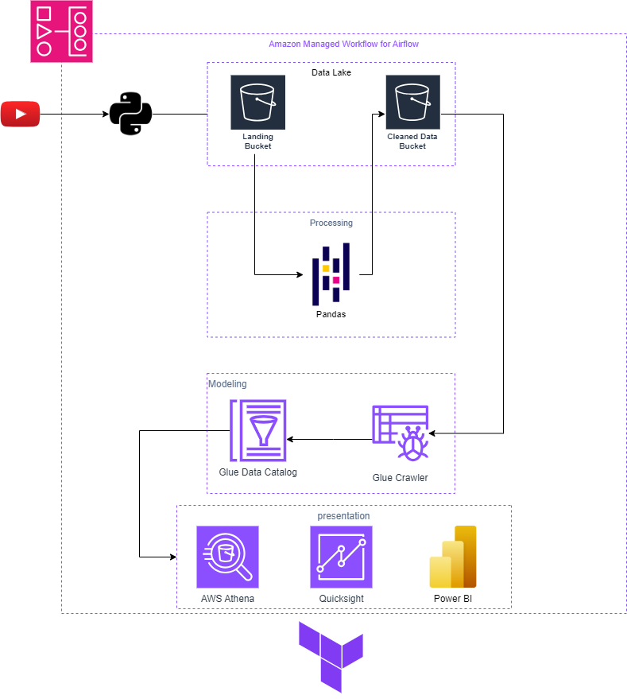

# youtube-DE

In this project, I tried to this [dataset](https://www.kaggle.com/datasets/datasnaek/youtube-new) as a real-life data engineering project. 

I used Amazon Managed Workflows for Apache Airflow to host the airflow server to schedule and automate the whole workflow.

I used Terraform as an Infrastructure as Code tool to make it easy to build all my aws resources and destroy them at the end of the day

The workflow of this project is :
- retrieve the data from YouTube API with python [code](https://github.com/mdeghady/youtube-DE/blob/main/dags/myUtils/YoutubeRequest.py)

- push the retrieved JSON file from YouTube API to xcom for further processing & to the S3 landing bucket to ease reconciliation between source systems and the cleaned data.

- pull the JSON file from xcom to process it and save the processed data as Apache parquet files according to the country code

- push cleaned Apache parquet files to Cleaned Data Bucket

- trigger Glue Crawler to start crawling the data & ingesting them to aws data catalog

I built a data lake house consisting of four layers :
* Data Lake
* Processing Layer
* Modeling Layer
* Presentation Layer

## Data Lake:
consists of two buckets:
* Landing Bucket:
    acts as a buffer zone between the source and processing & modeling layers, and it has the retrieved data in their native format (JSON).
* Cleaned Data Bucket: 
    contains the data after processing it with the pandas module on the airflow server. it has the data ready to be cleaned and ready to be consumed in columnar data file format (parquet) to be easily scanned or ingested. This bucket has partition indexes to act as database indexes in the modeling layer to optimize the query performance of presentation layer tools.

## Processing Layer:
It consists of  [pandas code](https://github.com/mdeghady/youtube-DE/blob/main/dags/myUtils/upload_data_to_s3.py) to clean the JSON files from the landing bucket and ingest them into the cleaned data bucket.
The cleaning steps are:
1. normalizing the JSON to make it easy to access with pandas
2. delete unnecessary columns
3. fixing the corrupted column data types
4. renaming the columns to more clear names

## Modeling Layer:
In this layer, I used AWS Glue services to make a database from the parquet files located in the cleaned data bucket.

-The workflow on this layer starts with the AWS Glue Crawler to populate the AWS Glue Data Catalog with tables with data from the cleaned data bucket & the first crawl Glue Crawler creates the database and the tables in the Glue Data Catalog. Crawler can automatically add partition indexes for newly discovered tables to optimize query processing on the partitioned dataset.

## Presentaion layer :
On this layer, we can add any tool or service to consume the database from aws data catalog such as:
- Query tools (Amazon Athena)
- BI tools (e.g. Power BI, Amazon QuickSight)

